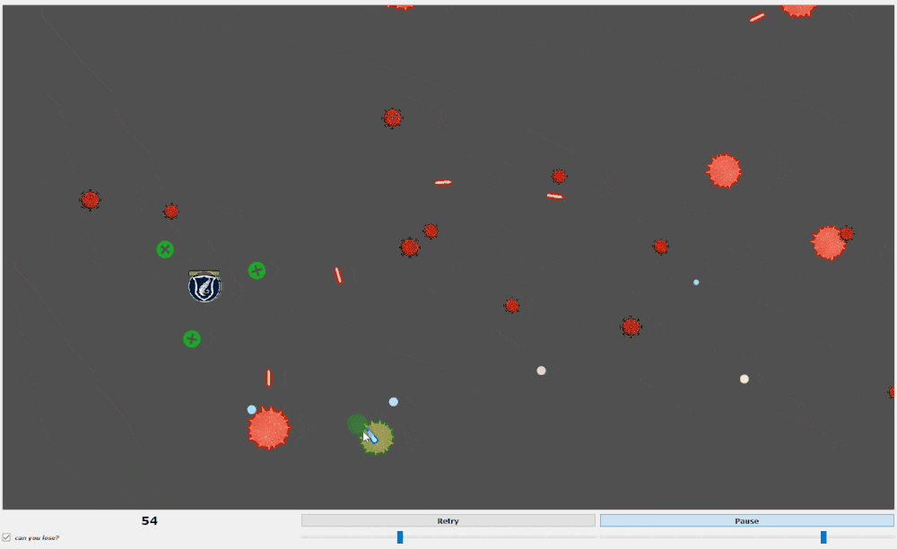
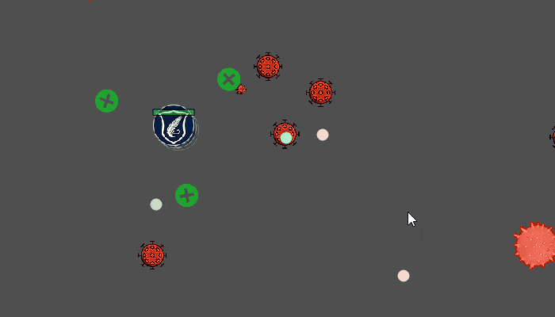
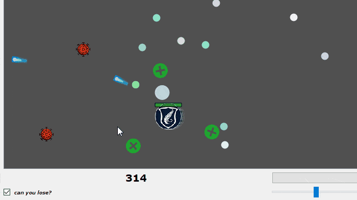
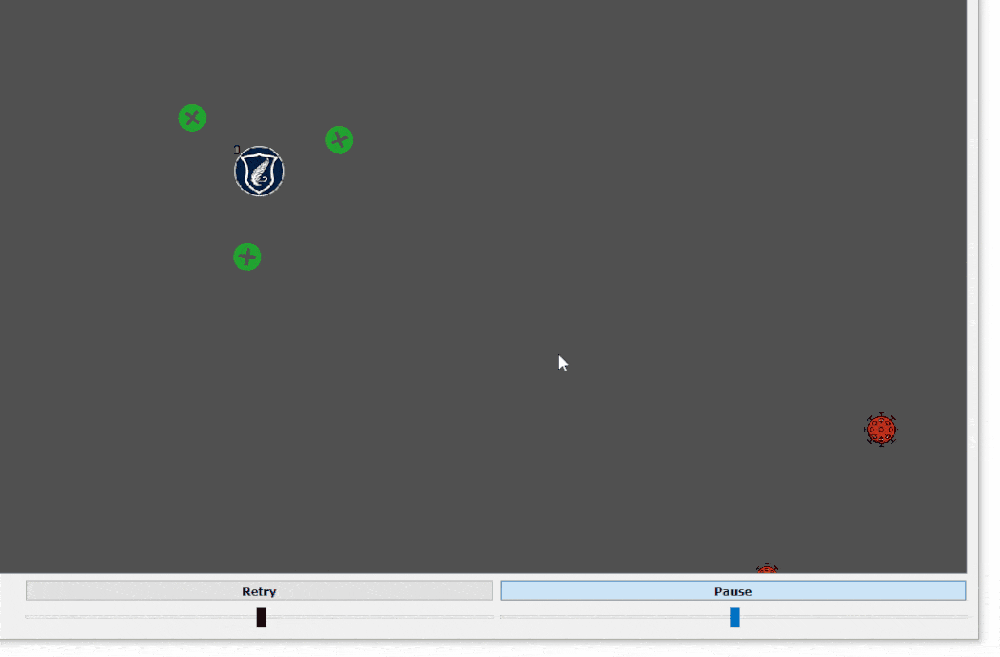
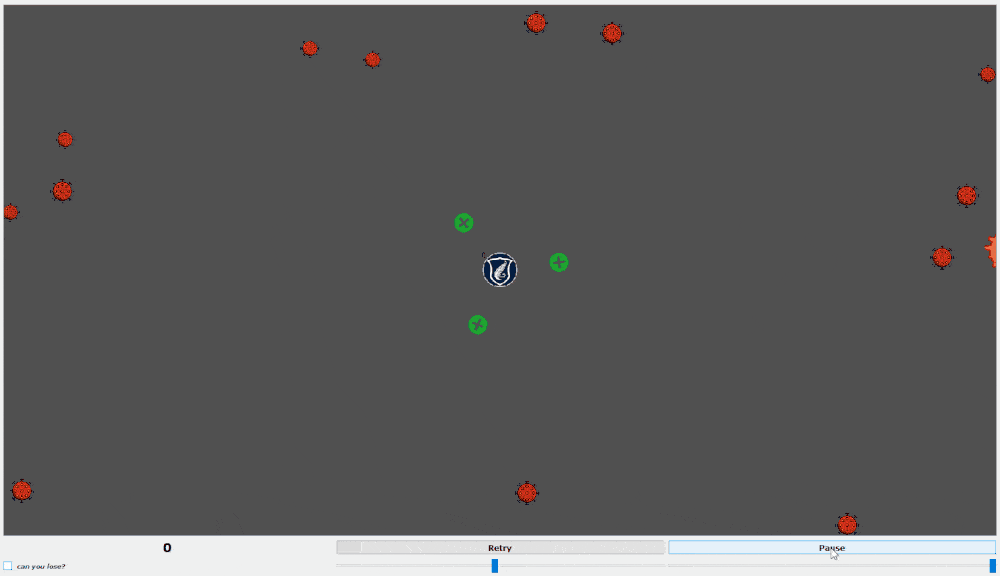

# Corona Defense Game
## BSU FAMCS 2020
### An educational project in C++ and Qt made in a form of a mini-game.

This repository contains source code and release version of a laboratory #3 in Qt. 
It's implemented in pure C++ using Qt framework. I've made it in a form of mini-game which I wanted to store somewhere so here is this repository :)
You can try it yourself using release section above.

### What's inside?
This game was written in early 2020, the beginning of COVID-19 so player is supposed to be in a role of BSU (Belarusian State University) defending itself from coronavirus and try to last as long as they can.

You can shoot virus cells, hit them with Health Beads or explode your enemys with Health Nova. 
Meanwhile virus cells would try to chase you and hit your body with their poisonous bullets.
As long as you cope with enemys, you will get points for each virus cell beaten and each health dot earned.
The more points you get the cooler you are :)  

|  |  |
| --- | --- |

### Too easy?

Then adjust your difficulty by using virus spawn amount and speed sliders. You can pause the game and change between survival and trainig modes.
 

|  |   |
| --- | --- |

### Final remark
The game might look cute but neither does the code :)
As it's a laboratory work I've made it in two nights without any real experience in Qt or production programming. 
Looking back I understand how clumsy, non-flexible and non-structured the code stored here is. So it might not be a great idea to give it a look :)
Alhtough it sounds disappointing, code here reminds me of a progress I've done in programming so far which is a bit of inspiration to me. So I let this thing be stored in a public repo :)

      